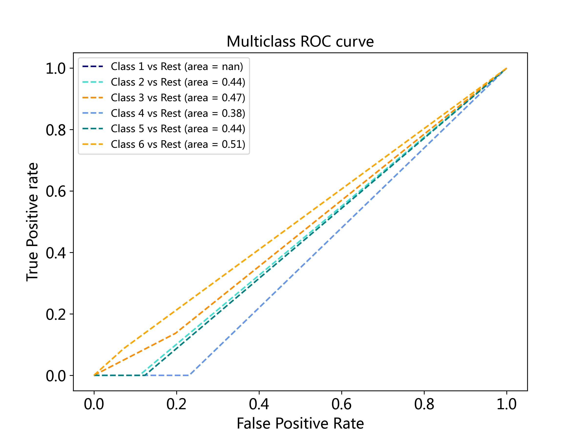
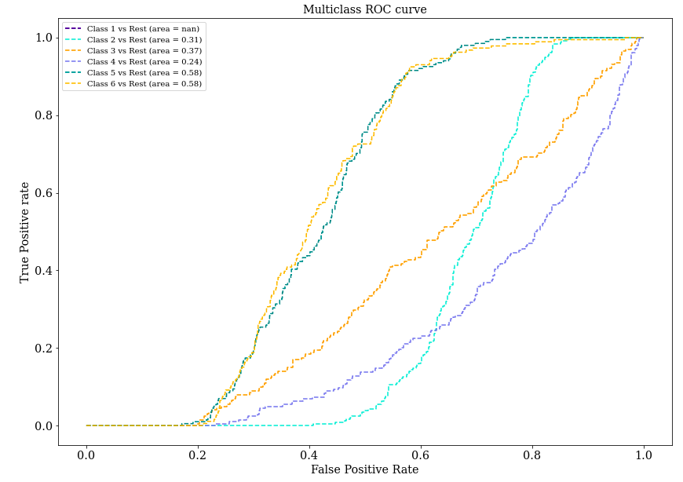

# Characterization of forms and classification

     

Based on [PCA](https://en.wikipedia.org/wiki/Principal_component_analysis), synthesize 3 classifier ([KNN](https://en.wikipedia.org/wiki/K-nearest_neighbors_algorithm), [KMeans](https://en.wikipedia.org/wiki/K-means_clustering), [SVM](https://en.wikipedia.org/wiki/Support-vector_machine)), with generating images set from the scratch, achieve high test accuracy: *95%* of **KNN**, *93%* of **KMeans** and *97%* of **SVM**.

## Prerequisites

#### Dependencies

 * [Numpy](http://www.numpy.org/)
 * [cv2](https://pypi.org/project/opencv-python/)
 * [Matlplotlib](http://matplotlib.org/) (for graphing)
 * [sklearn](https://pypi.org/project/playground/) 
 * [tqdm](https://github.com/tqdm/tqdm)
 * [pickle](https://docs.python.org/3/library/pickle.html)

```bash
git clone git@github.com:LonelVino/image_processing.git
cd image_processing
pip install -r requirements.txt
```

#### Dataset

The train and test images can be found in [kaggle dataset](https://www.kaggle.com/lonelvino/img-clf-cs).

Please download the image data set and save it in the parent path of this project, named the folder containing the training images **'appr'**, named the folder containing the test images **'appr'**, as shown below:

```
┣ 📦image_processing
   ┣ 📦appr  ### Train Dataset !!!
     ┣ 📂binarized
     ┣ 📂contour
     ┣ 📂contour_central
     ┣ 📂fft
     ┗ 📂origin
   ┣ 📦reference
   ┣ 📦main
   ┣ 📦test  ### Test dataset !!!
     ┣ 📂binarized
     ┣ 📂contour
     ┣ 📂contour_central
     ┣ 📂fft
     ┗ 📂origin
   ┣ 📜KMeans.py
   ┣ 📜PCA.py
   ┣ 📜README.md
   ┣ 📜.........
   ┗ 📜utlis.py
```

## Usage

### Generate Images Dataset

```bash
python3 main/gene_process.py [-h] [-N [Number]] [-L [BOOLEAN]] [-OPth [Path]] [-SPth [Path]]
                       [-T [Type]]
```

```bash
optional arguments:
  -h, --help            show this help message and exit
  -N [Number], --num [Number]
                        Number of Generated Images (Only required when generating images)
  -L [BOOLEAN], --is_load [BOOLEAN]
                        Load original images from folder
  -OPth [Path], --img_path [Path]
                        Path of Original images
  -SPth [Path], --save_path [Path]
                        Path of images to save
  -rT [Type], --ref_img_type [Type]
                        Type of reference images to load
  -T [Type], --img_type [Type]
                        Type of origin images to save / Type of images to save
  -DS [BOOLEAN], --gene_dataset [BOOLEAN]
                        Generate Dataset when loading images
```

**<font color=red>For example:</font>**

- **Generate images from reference images (No transformed images)**:<br>
   `python3 main/gene_process.py -N 500 -L n -OPth reference -SPth appr -rT png -T png -DS n`<br>
   By running the command above, *500*transformed images will be generated based on the reference images, these transformed images be saved in a folder `appr/origin`. Then the processed images (binarized, contour, fft) will be generated based on the *500* transformed images and be saved in a folder `/appr/test`.
   > If just generate transformed images, not process the images, please add an argument `-P n`, i.e. `python3 main/gene_process.py -N 500 -L n -OPth reference -SPth appr -rT png -T png -DS n -P n`
- **Generate images from transformed images**:<br>
   `python3 main/gene_process.py -L y -OPth appr/origin -SPth appr -rT png -T png -DS n`<br>
   By running the command above, all transformed images will be loaded from `appr/origin`. These images will be processed (binarization, contour extraction, fft), and processed images will be saved in a folder `/appr/`.


### View images

View all images in a folder as slides.
```bash
python3 main/view_img.py [-h] [-Pth [Path]] [-T [Type]]
```

```bash
optional arguments:
  -h, --help            show this help message and exit
  -Pth [Path], --img_path [Path]
                        Path of images
  -T [Type], --img_type [Type]
                        Type of images
```
**<font color=red>For example:</font>**

`python3 main/view_img.py -Pth appr/fft -T png`


### Classify

```bash
python3 main/classify.py  [-h] [-M Methods [Methods ...]] [-N [Number]] [-PN [Number]]
                   [-P [BOOLEAN]] [-K [BOOLEAN]]                
```

```
optional arguments:
  -h, --help            show this help message and exit
  -M Methods [Methods ...], --methods Methods [Methods ...]
                        Classifier
  -N [Number], --num [Number]
                        Number of Training Images
  -RPth [Path], --train_img_path [Path]
                        Path of Traininig images
  -TPth [Path], --test_img_path [Path]
                        Path of Test images
  -PN [Number], --pca_n [Number]
                        Number of PCA Components
  -KN [Number], --kmeans_n [Number]
                        Number of Kmeans Clusters
  -P [BOOLEAN], --pca [BOOLEAN]
                        Find Best Number of Components of PCA
  -K [BOOLEAN], --kmeans [BOOLEAN]
                        Find Best Number of clusters of KMeans
                        (Expected Boolean Value:
                        'yes', 'true', 't', 'y', '1'
                        'no', 'false', 'f', 'n', '0')

```

**<font color=red>For example:</font>**

 `python3 main/classify.py -M KNN KMeans -RPth appr/fft -TPth test/fft -N 5000 -PN 18`

By running the command above,   *5000* images in `appr/ftt` will be used to train **KMeans** and **KNN** based on  18 principal components, and then to classify *500* test images in `test/fft`.

## Performance

#### KNN

1. The best *N* components of **PCA** with **KNN**


2. **Confusion Matrix on Validation Set and Test Set**

   

3. **Precision-Recall Curve (PRC) and Receiver Operating Characteristic Curve (ROC)**:

   

#### KMeans

1. The *best N component*s of **PCA** with **KMeans**, and the *best number of clusters* of **KMeans**:

   

As we can see above, the *best N component*s of **PCA** is about *<u>16</u>* and the clustering performance improves as the *number of clusters* of **KMeans** increases, according to 5 important metrics ([Inertia](https://scikit-learn.org/stable/modules/clustering.html), [Homogeneity](https://scikit-learn.org/stable/modules/generated/sklearn.metrics.homogeneity_score.html), [Completeness](https://scikit-learn.org/stable/modules/generated/sklearn.metrics.completeness_score.html#sklearn.metrics.completeness_score), [V measure](https://scikit-learn.org/stable/modules/generated/sklearn.metrics.v_measure_score.html), [ARI](https://scikit-learn.org/stable/modules/generated/sklearn.metrics.adjusted_rand_score.html), [AMI](https://scikit-learn.org/stable/modules/generated/sklearn.metrics.adjusted_mutual_info_score.html)).

> Theoretically the more clusters, the better the metrics, however, please note this will result in over-fitting and computation time explosion.

2. **Confusion Matrix on Validation Set and Test Set**

   

   

#### SVM

1. The best *N* components of **PCA** with **SVM**

   

2. **Confusion Matrix on Validation Set and Test Set**

   

3. **PRC** curves  and **ROC** curves

         

#### **Example of Misclassified Images**


More classification information, please refer to: [Classification Report](assets/ClassificationReport.md)


## File Structure

```
┣ 📦image_processing
   ┣ 📦appr   # Train Dataset
     ┣ 📂binarized
     ┣ 📂contour
     ┣ 📂contour_central
     ┣ 📂fft
     ┗ 📂origin
   ┣ 📦reference
     ┣ 📜obj101.bmp
     ┣ 📜.........
     ┗ 📜obj601.bmp
   ┣ 📦main
     ┣ 📜classify.py
     ┗ 📜gene_process.py
   ┣ 📦test  # Test dataset 
     ┣ 📂binarized
     ┣ 📂contour
     ┣ 📂contour_central
     ┣ 📂fft
     ┗ 📂origin
   ┣ 📜KMeans.py
   ┣ 📜PCA.py
   ┣ 📜README.md
   ┣ 📜__init__.py
   ┣ 📜classify.py
   ┣ 📜dataset.py
   ┣ 📜evaluation.py
   ┣ 📜generate.py
   ┣ 📜image_process.py
   ┣ 📜img_shift.py
   ┣ 📜requirements.txt
   ┗ 📜utlis.py
```


## Reference

1. Zhang, Qi, et al. "A generic multi-projection-center model and calibration method for light field cameras." *IEEE transactions on pattern analysis and machine intelligence* 41.11 (2018): 2539-2552.
2. Lu, Junwei, et al. "Sparse Principal Component Analysis in Frequency Domain for Time Series."
3. Rama, Antonio, et al. "Partial PCA in frequency domain." *2008 50th International Symposium ELMAR*. Vol. 2. IEEE, 2008.
4. Performance Comparison of Target Classification in SAR Images Based on PCA and 2D-PCA Features Changzhen QIU, Hao REN, Huanxin ZOU, Shilin ZHOU
5. Qiu, Changzhen, et al. "Performance comparison of target classification in SAR images based on PCA and 2D-PCA features." *2009 2nd Asian-Pacific Conference on Synthetic Aperture Radar*. IEEE, 2009.
6. Ayiah-Mensah, Francis, et al. "Recognition of augmented frontal face images using FFT-PCA/SVD algorithm." *Applied Computational Intelligence and Soft Computing* 2021 (2021).
7. Molchanov, Vladimir, and Lars Linsen. "Overcoming the Curse of Dimensionality When Clustering Multivariate Volume Data." *VISIGRAPP (3: IVAPP)*. 2018.
7. [Andrew Rosenberg and Julia Hirschberg, 2007. V-Measure: A conditional entropy-based external cluster evaluation measure](https://aclweb.org/anthology/D/D07/D07-1043.pdf)
7. Martinsson, Per-Gunnar, Vladimir Rokhlin, and Mark Tygert. "A randomized algorithm for the decomposition of matrices." *Applied and Computational Harmonic Analysis* 30.1 (2011): 47-68.
7. Halko, Nathan, Per-Gunnar Martinsson, and Joel A. Tropp. "Finding structure with randomness: Probabilistic algorithms for constructing approximate matrix decompositions arXiv [math. NA]." (2009).

