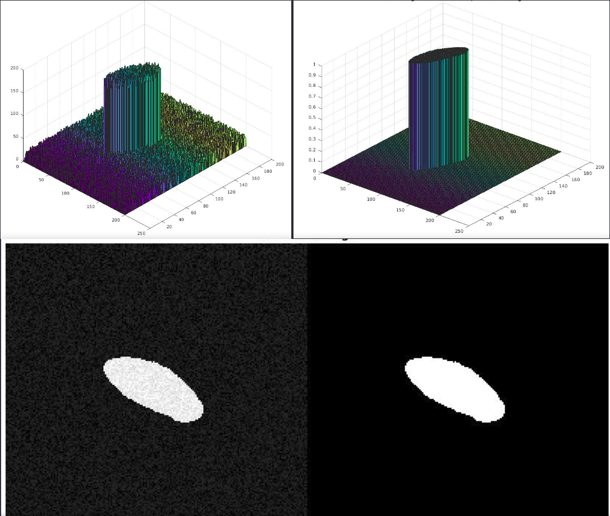
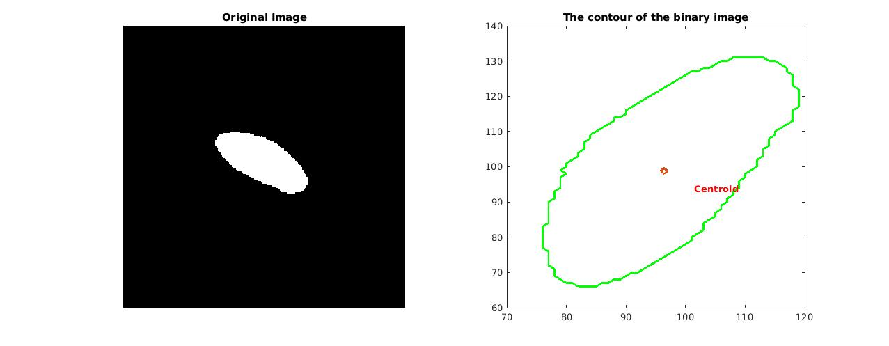
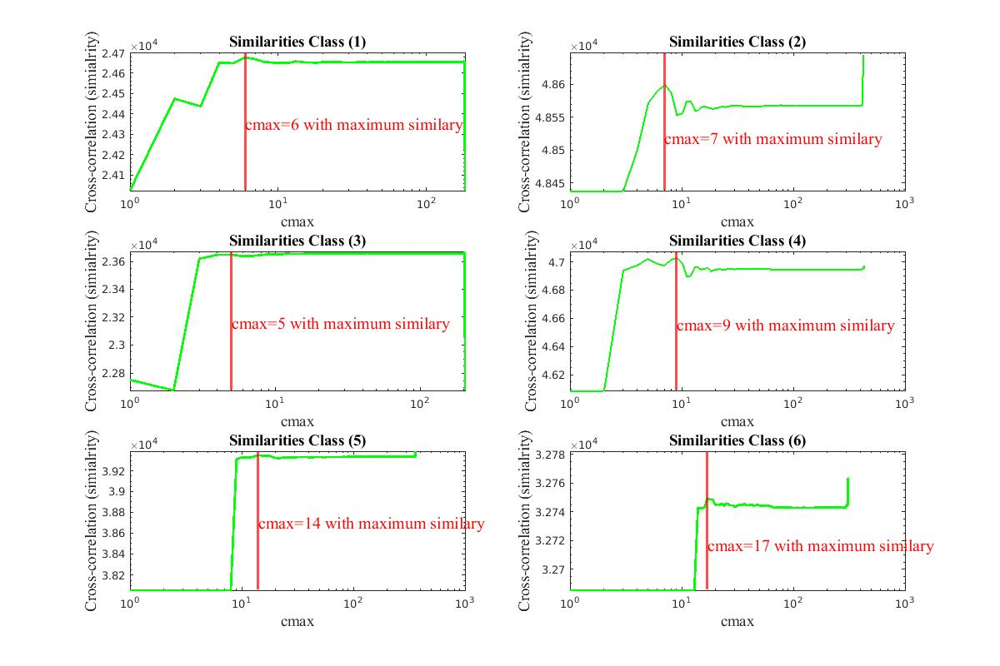
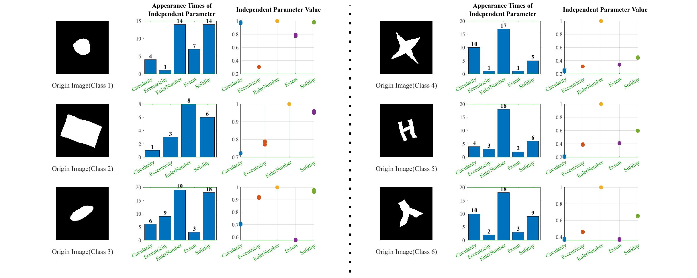
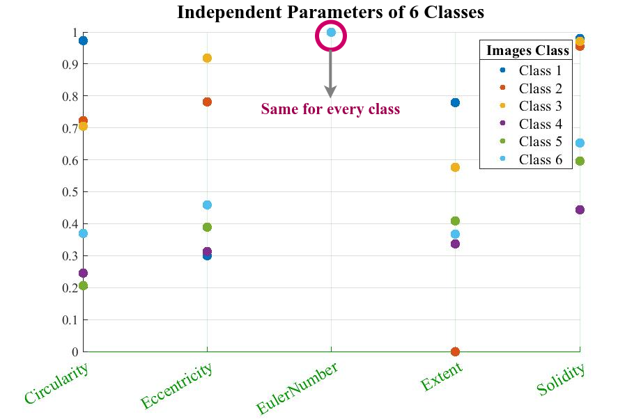

[Python Version](https://github.com/LonelVino/image_processing/tree/master)

## Image Samples

## Binarization and Contour Extraction

## Best Truncation Length of FFT

## Independent Parameters

